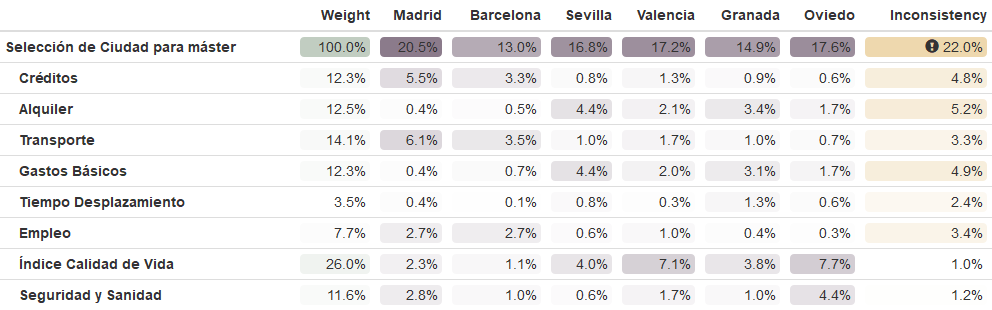
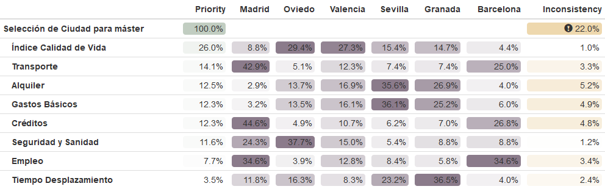

```{r setup_inicial, include=FALSE}
knitr::opts_chunk$set(echo = TRUE, message = FALSE, warning = FALSE)
```

\pagebreak

# Introducción

Este trabajo tiene como objetivo aplicar técnicas de decisión multicriterio para seleccionar la ciudad más adecuada para cursar un máster en Estadística. He elegido este tema porque, al finalizar el grado en Estadística, muchos estudiantes optamos por continuar nuestra formación con un máster especializado, y la elección de la ciudad donde cursarlo resulta clave, ya que influye tanto en la calidad académica como en las oportunidades profesionales y personales. 
En el análisis se tienen en cuenta distintos criterios relacionados con la calidad académica y las condiciones personales y económicas, comparando seis ciudades españolas

# Criterios y alternativas

**Criterios evaluados**:

- Oferta académica

- Coste de vida

- Transporte

- Oportunidades laborales

- Calidad de vida

**Alternativas consideradas**:

- Madrid

- Barcelona

- Sevilla

- Valencia

- Granada

- Oviedo

# Justificación de los criterios

## Oferta académica

Se considera la "Oferta académica" como uno de los criterios principales, ya que la calidad y variedad de los programas disponibles son determinantes a la hora de elegir la ciudad para cursar el máster. Para asignar las puntuaciones a las distintas ciudades en el criterio “Oferta académica”, se han considerado los siguientes subcriterios:

- **Duración y créditos** del máster (créditos): másteres de 120 créditos o de 60 créditos. Objetivo: **maximizar**.

> **Aclaración**

> Para el criterio “Oferta académica”, se han consultado los planes de estudio oficiales de másteres en estadística en las universidades de cada ciudad. Además de analizar los planes de estudio específico, se ha consultado el ranking QS 2026 para valorar el prestigio general de las universidades. Sin embargo, dado que el criterio "Oferta académica" se centra en másteres concretos en Estadística, el ranking global no ha modificado apenas las puntuaciones asignadas.

## Coste de vida

El criterio "Coste de vida" se considera esencial en la elección de la ciudad, ya que afecta directamente a la viabilidad económica del estudiante durante el máster. Para asignar las puntuaciones de las distintas ciudades, se han considerado los siguiente subcriterios:

- **Precio medio de alquiler** (€/mes): piso de una habitación en el centro de la ciudad. Objetivo: **minimizar**.

- **Transporte público** (€/mes): coste mensual del billete y abono mensual. Objetivo: **minimizar**.

- **Gastos básicos** (€/mes): precio medio de alimentación (productos como leche, pan, carne, fruta) y servicios (agua, luz, internet). Objetivo: **minimizar**.

> **Aclaración**

> Para el criterio "Coste de vida" se han consultado los datos actualizados de la web Numbeo (octubre 2025), comparando los subcriterios indicados.


## Transporte
El criterio "Transporte" evalúa la facilidad, rapidez y cobertura del sistema de transporte público desde el centro de cada ciudad hasta la universidad correspondiente. 
Se han considerado los siguientes subcriterios para la asignación de puntuaciones:

- **Tiempo medio de desplazamiento** (minutos): desde el centro hasta el campus. Objetivo: **minimizar**.

> **Aclaración**

> Para el criterio "Transporte", se han consultado las fuentes oficiales de movilidad y aplicaciones como Moovit, EMT y webs universitarias, así como mapas y horarios.


## Oportunidades laborales

El criterio "Oportunidades laborales" evalúa la posibilidad de encontrar empleo en el ámbito de la estadística en cada ciudad, tanto por la tasa de inserción laboral como por la oferta actual de empleo.
Se han considerado los siguientes subcriterios:

- **Tasa de empleo** de titulados en estadística según el INE (2019) (%). Objetivo: **maximizar**.

> **Aclaración**

> Para el criterio "Oportunidades laborales", se han consultado datos del Instituto Nacional de Estadística (INE) sobre la tasa de empleo de titulados en Estadística por comunidad autónoma, así como el volumen de ofertas actuales en InfoJobs (octubre 2025).

## Calidad de vida

El criterio "Calidad de vida" evalúa el bienestar general que ofrece cada ciudad. Aunque no afecta directamente al contenido académico, si influye en la experiencia personal, el entorno diario y el equilibrio entre estudio y vida. 
Se han considerado los siguientes subcriterios:

- **Índice general de calidad de vida**: para comparar el bienestar general entre ciudades. Objetivo: **maximizar**.

- **Seguridad y sanidad**: ciudades con buena atención médica y bajos índices de criminalidad obtienen mejor puntuación. Objetivo: **maximizar**.

> **Aclaración**

> Para el criterio "Calidad de vida", se han consultado los datos actualizados de Numbeo (octubre 2025).

\pagebreak

# Planteamiento del problema

```{r}
source("teoriadecision_funciones_multicriterio.R")
source("teoriadecision_funciones_multicriterio_diagram.R")
source("teoriadecision_funciones_multicriterio_utiles.R")
```

## Matriz de decisión

Vamos a construir la matriz de decisión con los valores de los subcriterios para cada ciudad.

```{r}
library(knitr)
library(kableExtra)

# Matriz de decisiones
p_ciudades_sub= multicriterio.crea.matrizdecision(c(
  #Madrid
  120, -803.4, -36, -300, -22, 90.5, 177.98, 75.67,
  #Barcelona
  60, -796.8, -23, -190, -32, 91.1, 144.17, 62.37,
  #Sevilla
  0, -676.6, -35.30, -120, -28, 80, 173.47, 68.31,
  #Valencia
  60, -689.4, -30, -155, -33, 84.1, 203.97, 72.32, 
  #Granada
  60, -659.4, -35, -170, -18, 80, 184.12, 70.82,
  #Oviedo
  60, -704.5, -30, -160, -23, 78, 205.39, 83.48
), numalternativas = 6, numcriterios = 8)
p_ciudades_sub

kable(p_ciudades_sub, caption = "Matriz de decisión con subcriterios", digits = 2)
```

\pagebreak

# Aplicación de métodos multicriterio

## Método ELECTRE

El método ELECTRE trata de separar el conjunto de todas las alternativas en dos subconjuntos, uno formado por las alternativas más favorables y otro formado por las peores opciones, y todo ello con ayuda de un grafo. El método funciona de forma secuencial, reduciendo el conjunto de alternativas favorables, hasta obtener una sola.
**
 Podemos diferenciar **tres fases** en el método ELECTRE:

- Test de concordancia.

- Test de discordancia.

- Construcción del grafo de sobreclasificación.

```{r}
salida_electre= multicriterio.metodoELECTRE_I(p_ciudades_sub, pesos.criterios = c(0.28, 0.13, 0.08, 0.13, 0.1, 0.15, 0.07, 0.06), nivel.concordancia.minimo.alpha = 0.7, no.se.compensan=c(Inf, 100, 30,100, 15, Inf, 30,20), que.alternativas = TRUE )
qgraph::qgraph(salida_electre$relacion.dominante)
salida_electre$nucleo_aprox
```
> **Conclusión**

> El grafo generado muestra las siguientes relaciones de dominancia:
**Granada** (a5) domina a **Sevilla** (a3) y a **Barcelona** (a2); **Valencia** (a4) domina a **Oviedo** (a6); **Oviedo** (a6) domina a **Barcelona** (a2)
Las ciudades dominadas, y por lo tanto consideradas las peores candidatas bajo este modelo, son **Barcelona** (a2), **Sevilla** (a3), y **Oviedo** (a6).
Por el núcleo aproximado obtenido (a1, a4, a5), vemos que **Madrid** (a1), **Valencia** (a4), y **Granada** (a5) no son dominadas por ninguna otra ciudad en la relación de sobreclasificación, por l que son las mejores alternativas y deben ser consideradas para la elección final.

Para intentar quedarse con una única alternativa óptima: reducir el grado a las alternativas en el núcleo y/o reducir el valor de alpha $\in$ [0.5,1).

```{r}
salida_electreb= multicriterio.metodoELECTRE_I(p_ciudades_sub, pesos.criterios = c(0.28, 0.13, 0.08, 0.13, 0.1, 0.15, 0.07, 0.06), nivel.concordancia.minimo.alpha = 0.7, no.se.compensan =c(Inf, 100, 30,100, 15, Inf, 30,20), que.alternativas = c(1,4,5) )
qgraph::qgraph(salida_electreb$relacion.dominante)
salida_electreb$nucleo_aprox
```

> **Conclusión**

> El grafo generado no muestra nuevas relaciones de dominancia entre las ciudades del núcleo.
El núcleo aproximado sigue incluyendo las mismas ciudades. 
Esto indica que, bajo alpha=0.7 y los umbrales de discordancia definidos, no existe una ciudad que domine claramente a las demás dentro del núcleo.

Como hemos reducido las alternativas antes, vamos a ver ahora si reducimos alpha.

```{r}
salida_electrec= multicriterio.metodoELECTRE_I(p_ciudades_sub, pesos.criterios = c(0.28, 0.13, 0.08, 0.13, 0.1, 0.15, 0.07, 0.06), nivel.concordancia.minimo.alpha = 0.5, no.se.compensan =c(Inf, 100, 30,100, 15, Inf, 30,20), que.alternativas = c(1,4,5) )
qgraph::qgraph(salida_electrec$relacion.dominante)
salida_electrec$nucleo_aprox
```
> **Conclusión**

> Al reducir el nivel de concordancia mínima a alpha= 0.5 y aplicar el método exclusivamente a las ciudades del núcleo (Madrid, Valencia, Granada), el modelo finalmente establece una relación de dominancia estricta:
**Granada** (a5) domina a **Madrid** (a1). Como consecuencia, el núcleo aproximado se ha reducido al conjunto: **Valencia y Granada**.
Esto demuestra que estas ciudades se consolidan como las dos mejores ciudades candidatas para cursar el máster en Estadística, ya que han resistido el proceso de eliminación tanto con el conjunto original de alternativas como en la reducción del núcleo con diferentes parámetros.

## Método ELECTRE I

```{r}
e1=func_ELECTRE_Completo(salida_electre)
e1$Grafo
```

```{r}
qgraph::qgraph(e1$Grafo)
```

```{r}
e1$Nucleo 
```

> **Conclusión**

> El grafo generado mediante el método ELECTRE I establece las siguientes relaciones de dominancia estricta:
**Granada** (a5) domina a **Sevilla** (a3) y a **Barcelona** (a2); **Valencia** (a4) domina a **Oviedo** (a6) y **Oviedo** (a6) domina a **Barcelona** (a2).
Por el contrario, la ciudad de **Madrid** (a1) no domina ni es dominada por ninguna otra.
El Núcleo obtenido es el conjunto: **Madrid, Valencia y Granada**. Estas tres ciudades son las alternativas robustas que no son superadas por ninguna otra.
Las ciudades dominadas con las opciones menos recomendables para el máster según el análisis.

\pagebreak

## Método PROMETHEE

El método PROMETHEE incluye los tres pasos siguientes:

- Enriquecimiento de la estructura de preferencias. LA noción de **criterio generlizado** o pseudocriterio es introducida con arreglo a tener en cuenta las amplitudes de las desviaciones entre las evaluaciones.

- Enriquecimiento de la relación de dominación. Se ha construido un gráfico que expresa la relación de orden. Los arcos expresan cuánto domina unas alternativas a otras.

- Explotación para la ayuda en la decisión. El PROMETHEE I proporciona una relación de superación que incluye aquellas posibilidades que son incomparables. El II proporciona un orden total (sin incomparabilidades), lo cual puede parecer más eficiente, pero de hecho la información proporcionada en más cuestionable.

Para comenzar, la siguiente tabla recoge, para cada subcriterio evaluado, el tipo de función de preferencia seleccionada en el método PROMETHEE, así como los parámetros asociados necesarios para su aplicación. L elección de cada función se ha realizado en función de la naturaleza del subcriterio, y los valores de los parámetros se han estimado a partir del rango observado en los datos.

| Criterio | Peso | Optimización | Tipo de Función de pref. | qi | pi | si |
| :---: | :---: | :---: | :---: | :---: | :---: | :---: |
| **C1** | 0.20 | Maximizar | Preferencia Lineal | - | 30 | - |
| **C2** | 0.10 | Minimizar | Nivel | 7 | 36 | - |
| **C3** | 0.08 | Minimizar | Cuasi-criterio | 1 | - | - |
| **C4** | 0.10 | Minimizar | Nivel | 9 | 45 | - |
| **C5** | 0.10 | Minimizar | Cuasi-criterio | 0.3 | - | - |
| **C6** | 0.10 | Maximizar | Cuasi-criterio | 0.7 | - | - |
| **C7** | 0.04 | Maximizar | Gaussiano | - | - | 24 |
| **C8** | 0.06 | Maximizar | Gaussiano | - | - | 8 |

Vamos a utilizar la misma matriz de decisión que antes y los mismos pesos, por lo que no volvemos a definirlos.

```{r}
tab.fpref= matrix(c(3,0,30,0,
                    4,7,36,0,
                    2,1,0,0,
                    4,9,45,0,
                    2,0.3,0,0,
                    2,0.7,0,0,
                    6,0,0,24,
                    6,0,0,8), nrow = 8, byrow = TRUE)
tab.fpref
```

#### Ejemplos de representación gráfica de las funciones de preferencia

##### Criterio de preferencia lineal

```{r fig.align='center', fig.width=7, fig.height=5}
x=seq(-200,200, length.out=100)
y=sapply(x, function(xx) fpref.cuasi_criterio(xx, 0, 50))
plot(x,y,type="l", col="blue", main="Criterio de preferencia lineal para el subcriterio 'Cobertura y Frecuencia' con pi=50", cex.main=0.8)
```

##### Criterio Nivel

```{r fig.align='center', fig.width=7, fig.height=5}
 x=seq(-200,200,length.out=100)
 y=sapply(x, function(xx)fpref.criterio_nivel(xx,0,9,45))
 plot(x,y,type="l",col="blue", main="Criterio usual para el subcriterio 'Gastos básicos'", cex.main=0.8)
```

##### Cuasi-criterio

```{r fig.align='center', fig.width=7, fig.height=5}
 x=seq(-20,20,length.out=100)
 y=sapply(x, function(xx)fpref.cuasi_criterio(xx,0,0.7))
 plot(x,y,type="l",col="blue", main="Criterio usual para el subcriterio 'Tasa de empleo'", cex.main=0.8)
```

##### Criterio gaussiano

```{r fig.align='center', fig.width=7, fig.height=5}
 x=seq(-30,30,length.out=100)
 y=sapply(x, function(xx)fpref.criterio_gaussiano(xx,0,0,0,8))
 plot(x,y,type="l",col="blue", main="Criterio usual para el subcriterio 'Seguridad y sanidad'", cex.main=0.8)
```

### Método PROMETHE I

```{r}
tab.Pthee.i=multicriterio.metodo.promethee_i(p_ciudades_sub, pesos.criterios = c(0.28, 0.13, 0.08, 0.13, 0.1, 0.15, 0.07, 0.06), tab.fpref)
tab.Pthee.i
```

Representamos como un grafo: 

```{r}
require("qgraph")
qgraph(tab.Pthee.i$tablarelacionsupera)
```

> **Conclusión**

> El método PROMETHEE I establece una ordenación parcial de las ciudades, basada en los flujos de preferencia (phi+ y phi-. Los resultados clave son:
**Sevilla** (a3) se posiciona como la alternativa más fuerte: Presenta el mayor Flujo de Salida (phi+ = 2.62), lo que indica que es la más preferida por el resto de las ciudades. Además, tiene el menor Flujo de Entrada (phi- = 1.31), lo que significa que es la menos superada.
**Madrid** (a1) y **Valencia** (a4) muestran debilidad en el conjunto: **Madrid** (a1) tiene el Flujo de Entrada más alto (phi- = 2.53), siendo la alternativa más débil o la más superada por las demás; **Valencia** (a4) es la que tiene el Flujo de Salida más bajo después de Granada (phi+ = 1.40).
*Relación de Superación* (Grafo): La alta densidad de arcos indica que existe un alto número de alternativas incomparables, dificultando la elección de una única opción óptima.

### Método PROMETHEE II

```{r}
tab.Pthee.ii=multicriterio.metodo.promethee_ii(p_ciudades_sub, pesos.criterios = c(0.28, 0.13, 0.08, 0.13, 0.1, 0.15, 0.07, 0.06), tab.fpref)
tab.Pthee.ii
```

Representamos como un grafo:
```{r}
qgraph(tab.Pthee.ii$tablarelacionsupera)
```

**Ordenación final alternativas del Método PROMETHEE II**

La ordenación que establecen sería la siguiente:
```{r}
order(tab.Pthee.ii$vflujos.netos, decreasing = T)
```

> **Conclusión**

> **Madrid** (a1) se consolida como la mejor opción global, al obtener el Flujo Neto más alto (0.926), lo que significa que su balance de fortalezas y debilidades es el más favorable; **Granada** (a5) y **Valencia** (a4) le siguen de cerca con Flujos Netos positivos y similares (0.408 y 0.355, respectivamente), completando el trío de alternativas más recomendables; **Oviedo** (a6) presenta un Flujo Neto ligeramente positivo (0.081), ubicándose en la cuarta posición; **Barcelona** (a2) y, especialmente, **Sevilla** (a3) obtienen los Flujos Netos negativos, lo que indica que son más superadas que superadoras en la evaluación global. **Sevilla** (a3) se posiciona como la alternativa menos recomendable (-1.312).
*Este ranking (Madrid > Granada > Valencia) proporciona una solución única para la toma de decisión.*

### Método PROMETHEE I (medias)

```{r}
tab.Pthee.i_med=multicriterio.metodo.promethee_i_med(p_ciudades_sub, pesos.criterios = c(0.28, 0.13, 0.08, 0.13, 0.1, 0.15, 0.07, 0.06), tab.fpref)
tab.Pthee.i_med
```

Representamos como un grafo:

```{r}
qgraph(tab.Pthee.i_med$tablarelacionsupera)
```

> **Conclusión**

> *Dominancia en el Grafo*: Las ciudades **Madrid** (a1), **Valencia** (a4) y **Granada** (a5) son las únicas **alternativas dominantes**, superando en estricto a **Barcelona** (a2), **Sevilla** (a3) y **Oviedo** (a6). Esto consolida a **Madrid, Valencia, y Granada** como el conjunto de alternativas más robustas, al igual que en la primera etapa de ELECTRE.
*Análisis de Flujos Contradictorio*: Al contrario de la creencia de que Madrid es dominante en este método, el análisis de flujos revela lo siguiente: **Sevilla** (a3) tiene el mayor Flujo de Salida medio (0.5247), lo que significa que supera a las demás alternativas en el valor promedio más alto; **Madrid** (a1) tiene el mayor Flujo de Entrada medio (0.5052), lo que indica que es la alternativa que, en promedio, es más superada por el resto.
*Refuerzo de la Ordenación Parcial*: El método PROMETHEE I (medias) confirma el mismo conjunto de alternativas superiores que la primera etapa de ELECTRE I: a1, a4, a5. Sin embargo, los flujos (especialmente el alto phi- de Madrid) señalan un perfil de riesgo en la ciudad madrileña que será penalizado en la ordenación total (PROMETHEE II).

### Método PROMETHEE II (medias)

```{r}
tab.Pthee.ii_med=multicriterio.metodo.promethee_ii_med(p_ciudades_sub, pesos.criterios = c(0.28, 0.13, 0.08, 0.13, 0.1, 0.15, 0.07, 0.06), tab.fpref)
tab.Pthee.ii_med
```

Representamos como un grafo:
```{r}
qgraph(tab.Pthee.ii_med$tablarelacionsupera)
```

**Ordenación final alternativas método PROMETHEE II (medias)**

La ordenación que establecen sería la siguiente:

```{r}
order(tab.Pthee.ii_med$vflujos.netos, decreasing = T)
```

> **Conclusión**

> **Madrid** se confirma como la opción óptima con el Flujo Neto Normalizado más alto (0.1853), y domina a todas las demás ciudades en el grafo de superación; El podio lo completan **Granada** (a5) (0.0816) y **Valencia** (a4) (0.0710), manteniendo una sólida capacidad de superación sobre la mayoría de las alternativas; **Sevilla** (a3) y **Barcelona** (a2) vuelven a situarse al final de la ordenación con flujos netos negativos, siendo **Sevilla** (a3) la alternativa **menos** **favorable** (-0.2624).
La consistencia de los rankings de PROMETHEE II y PROMETHEE II (medias) refuerza la recomendación de **Madrid** (a1) como la ciudad **más adecuada** para cursar el máster en Estadística, **seguida de Granada y Valencia**.

### Resolución con Promethee Windows

Muestra los costos con signo negativo:

```{r}
(res=multicriterio.metodo.promethee_windows(p_ciudades_sub, tab.fpref, pesos.criterios = c(0.28, 0.13, 0.08, 0.13, 0.1, 0.15, 0.07, 0.06)))

```

Muestra los costos con signo positivo e identifica qué criterios son de maximizar y de minimizar:
```{r} 
(res=multicriterio.metodo.promethee_windows(p_ciudades_sub,tab.fpref,pesos.criterios= c(0.28, 0.13, 0.08, 0.13, 0.1, 0.15, 0.07, 0.06),
 fminmax= c("max","min","min","min","min","max","max","max")))
```

**Salidas del método Promethee más elegantes**

Con esta función se resuelve el problema con Promethee (igual que la aplicación Windows) y genera las salidas para ser imprimidas de un modo más elegante en función de la salida: “html”o“pdf”, según se elija.

```{r}
res02=multicriterio.metodo.promethee_windows_kableExtra(res)
```

Tabla que muestra la información por apartados introducidos en el problema resuelto con Promethee:

```{r}
res02$tabEscenario
```

Tabla que muestra la ordenación de las alternativas: ei:
```{r}
res02$tabAcciones
```

La ordenación (cuidado) es:
```{r}
rownames(res$Acciones)
```

> **Conclusiones**

> La aplicación del método PROMETHEE, tal como se implementa en la funcionalidad de 'Windows' (que consolida los cálculos con flujos normalizados), confirma plenamente la ordenación total previamente obtenida:
**Madrid** (a1) es la alternativa óptima, manteniendo el rango 1 con el Flujo Neto (Phi) más alto (0.1853). Su phi+ alto (0.5052) y un phi- relativamente bajo confirman su dominio general; **Granada** (a5) y **Valencia** (a4) se consolidan en el segundo y tercer puesto, respectivamente, con Flujos Netos positivos que demuestran un rendimiento superior al promedio; **Sevilla** (a3) se mantiene en la última posición (Rango 6), con el Flujo Neto más bajo (-0.2624) y el phi- más alto (0.5247), lo que la confirma como la ciudad menos recomendada.La coherencia de la ordenación en PROMETHEE II, PROMETHEE II (medias) y PROMETHEE Windows establece una conclusión firme sobre la solución más equilibrada para el decisor.

\pagebreak

## Método AHP

### Matriz de subcriterios 

| Criterio | **Créditos** | **Alquiler** | **Transporte** | **Gastos Básicos** | **Tiempo Desplazamiento** | **Empleo** | **Índice Calidad de Vida** | **Seguridad y Sanidad** |
| :---: | :---: | :---: | :---: | :---: | :---: | :---: | :---: | :---: | :---: |
| **Créditos** | 1 | 2 | 2 | 2 | 3 | 2 | 1/4 | 1/5 |
| **Alquiler** | 1/2 | 1 | 2 | 2 | 3 | 2 | 1/4 | 2 |
| **Transporte** | 1/2 | 1/2 | 1 | 2 | 3 | 2 | 1/3 | 5 |
| **Gastos Básicos** | 1/2 | 1/2 | 1/2 | 1 | 2 | 1 | 1/3 | 6 |
| **Tiempo Desplazamiento** | 1/3 | 1/3 | 1/3 | 1/2 | 1 | 1/2 | 1/4 | 1/5 |
| **Empleo** | 1/2 | 1/2 | 1/2 | 1 | 2 | 1 | 1/3 | 2 |
| **Índice Calidad de Vida** | 4 | 4 | 3 | 3 | 4 | 3 | 1 | 2 |
| **Seguridad y Sanidad** | 5 | 1/2 | 1/5 | 1/6 | 5 | 1/2 | 1/2 | 1 |

Esta es la tabla de preferencias entre los distintos subcriterios.

> Interpretación general:
- Prestigio (muy alto peso): porque determina el valor del máster en el mercado laboral.
- Empleo, Seguridad y Sanidad, e Índice de calidad de vida: también muy influyentes.
- Alquiler y Gastos básicos: influyen en la viabilidad económica.
- Ocio y Ofertas: factores secundarios.
- Créditos: importantes pero menos diferenciales (la mayoría de másteres tienen carga similar).

### Matrices de Alternativas / Criterios

Cada subcriterio se tratará según su tipo:

- Si es beneficio (mayor es mejor), la comparación favorecerá a los valores más altos.

- Si es coste (menor es mejor, por ejemplo Alquiler o Gastos básicos), la comparación favorecerá a los valores más bajos.

#### Subcriterio Créditos

| **Créditos** | **Madrid** | **Barcelona** | **Sevilla** | **Valencia** | **Granada** | **Oviedo** |
| :---------: | :----: | :-------: | :-----: | :------: | :-----: | :----: |
| **Madrid**  | 1 | 3 | 7 | 5 | 5 | 5 |
| **Barcelona** | 1/3 | 1 | 6 | 4 | 4 | 4 |
| **Sevilla** | 1/7 | 1/6 | 1 | 1/2 | 1 | 2 |
| **Valencia** | 1/5 | 1/4 | 2 | 1 | 2 | 3 |
| **Granada** | 1/5 | 1/4 | 1 | 1/2 | 1 | 2 |
| **Oviedo**| 1/5 | 1/4 | 1/2 | 1/3 | 1/2 | 1 |

#### Subcriterio Alquiler

| **Alquiler** | **Madrid** | **Barcelona** | **Sevilla** | **Valencia** | **Granada** | **Oviedo** |
| :---------: | :----: | :-------: | :-----: | :------: | :-----: | :----: |
| **Madrid**  | 1 | 1/2 | 1/7 | 1/6 | 1/8 | 1/7 |
| **Barcelona** | 2 | 1 | 1/6 | 1/5 | 1/7 | 1/6 |
| **Sevilla** | 7 | 6 | 1 | 3 | 2 | 3 |
| **Valencia** | 6 | 5 | 1/3 | 1 | 1/2 | 2 |
| **Granada** | 8 | 7 | 1/2 | 2 | 1 | 3 |
| **Oviedo**| 7 | 6 | 1/3 | 1/2 | 1/3 | 1 |

#### Subcriterio Transporte

| **Transporte** | **Madrid** | **Barcelona** | **Sevilla** | **Valencia** | **Granada** | **Oviedo** |
| :---------: | :----: | :-------: | :-----: | :------: | :-----: | :----: |
| **Madrid**  | 1 | 3 | 5 | 4 | 5 | 5 |
| **Barcelona** | 1/3 | 1 | 4 | 3 | 4 | 4 |
| **Sevilla** | 1/5 | 1/4 | 1 | 1/2 | 1 | 2 |
| **Valencia** | 1/4 | 1/3 | 2 | 1 | 2 | 3 |
| **Granada** | 1/5 | 1/4 | 1 | 1/2 | 1 | 2 |
| **Oviedo**| 1/5 | 1/4 | 1/2 | 1/3 | 1/2 | 1 |

#### Subcriterio Gastos Básicos

| **Gastos Básicos** | **Madrid** | **Barcelona** | **Sevilla** | **Valencia** | **Granada** | **Oviedo** |
| :---------: | :----: | :-------: | :-----: | :------: | :-----: | :----: |
| **Madrid**  | 1 | 1/3 | 1/7 | 1/5 | 1/6 | 1/6 |
| **Barcelona** | 3 | 1 | 1/5 | 1/3 | 1/4 | 1/4 |
| **Sevilla** | 7 | 5 | 1 | 3 | 2 | 3 |
| **Valencia** | 5 | 3 | 1/3 | 1 | 1/2 | 2 |
| **Granada** | 6 | 4 | 1/2 | 2 | 1 | 3 |
| **Oviedo**| 6 | 4 | 1/3 | 1/2 | 1/3 | 1 |

#### Subcriterio Tiempo Desplazamiento

| **Tiempo Desplazamiento** | **Madrid** | **Barcelona** | **Sevilla** | **Valencia** | **Granada** | **Oviedo** |
| :---------: | :----: | :-------: | :-----: | :------: | :-----: | :----: |
| **Madrid**  | 1 | 3 | 1/2 | 2 | 1/3 | 1/2 |
| **Barcelona** | 1/3 | 1 | 1/5 | 1/3 | 1/6 | 1/5 |
| **Sevilla** | 2 | 5 | 1 | 3 | 1/2 | 2 |
| **Valencia** | 1/2 | 3 | 1/3 | 1 | 1/4 | 1/2 |
| **Granada** | 3 | 6 | 2 | 4 | 1 | 3 |
| **Oviedo**| 2 | 5 | 1/2 | 2 | 1/3 | 1 |

#### Subcriterio Empleo

| **Empleo** | **Madrid** | **Barcelona** | **Sevilla** | **Valencia** | **Granada** | **Oviedo** |
| :---------: | :----: | :-------: | :-----: | :------: | :-----: | :----: |
| **Madrid**  | 1 | 1 | 5 | 4 | 5 | 6 |
| **Barcelona** | 1 | 1 | 5 | 4 | 5 | 6 |
| **Sevilla** | 1/5 | 1/5 | 1 | 1/2 | 2 | 3 |
| **Valencia** | 1/4 | 1/4 | 2 | 1 | 3 | 4 |
| **Granada** | 1/5 | 1/5 | 1/2 | 1/3 | 1 | 2 |
| **Oviedo**| 1/6 | 1/6 | 1/3 | 1/4 | 1/2 | 1 |

#### Subcriterio Índice Calidad de Vida

| **Índice Calidad de Vida** | **Madrid** | **Barcelona** | **Sevilla** | **Valencia** | **Granada** | **Oviedo** |
| :---------: | :----: | :-------: | :-----: | :------: | :-----: | :----: |
| **Madrid**  | 1 | 3 | 1/2 | 1/3 | 1/2 | 1/4 |
| **Barcelona** | 1/3 | 1 | 1/4 | 1/5 | 1/3 | 1/6 |
| **Sevilla** | 2 | 4 | 1 | 1/2 | 1 | 1/2 |
| **Valencia** | 3 | 5 | 2 | 1 | 2 | 1 |
| **Granada** | 2 | 3 | 1 | 1/2 | 1 | 1/2 |
| **Oviedo**| 4 | 6 | 2 | 1 | 2 | 1 |

#### Subcriterio Seguridad y Sanidad

| **Seguridad y Sanidad** | **Madrid** | **Barcelona** | **Sevilla** | **Valencia** | **Granada** | **Oviedo** |
| :---------: | :----: | :-------: | :-----: | :------: | :-----: | :----: |
| **Madrid**  | 1 | 3 | 4 | 2 | 3 | 1/2 |
| **Barcelona** | 1/3 | 1 | 2 | 1/2 | 1 | 1/4 |
| **Sevilla** | 1/4 | 1/2 | 1 | 1/3 | 1/2 | 1/5 |
| **Valencia** | 1/2 | 2 | 3 | 1 | 2 | 1/3 |
| **Granada** | 1/3 | 1 | 2 | 1/2 | 1 | 1/4 |
| **Oviedo**| 2 | 4 | 5 | 3 | 4 | 1 |

> Método 1

```{r}
tab_ciudad= multicriterio.crea.matrizvaloraciones_mej(c(2,2,2,3,2,1/4,1/5,
                                                        2,2,3,2,1/4,2,
                                                        2,3,2,1/3,5,
                                                        2,1,1/3,6,
                                                        1/2,1/4,1/5,
                                                        1/3,2,
                                                        2
                                                        ), numalternativas = 8,v.nombres.alternativas = c("Créditos", "Alquiler", "Transporte", "Gastos Básicos", "Tiempo Desplazamiento", "Empleo", "Índice Calidad de Vida", "Seguridad y Sanidad"))


tab_creditos <- multicriterio.crea.matrizvaloraciones_mej(
  c(3, 7, 5, 5, 5, 6, 4, 4, 4, 1/2, 1, 2, 2, 3, 2),
  numalternativas = 6,
  v.nombres.alternativas = c("Madrid", "Barcelona", "Sevilla", "Valencia", "Granada", "Oviedo")
)
tab_creditos

tab_alquiler <- multicriterio.crea.matrizvaloraciones_mej(
  c(1/2, 1/7, 1/6, 1/8, 1/7, 1/6, 1/5, 1/7, 1/6, 3, 2, 3, 1/2, 2, 3),
  numalternativas = 6,
  v.nombres.alternativas = c("Madrid", "Barcelona", "Sevilla", "Valencia", "Granada", "Oviedo")
)
tab_alquiler

tab_transporte <- multicriterio.crea.matrizvaloraciones_mej(
  c(3, 5, 4, 5, 5, 4, 3, 4, 4, 1/2, 1, 2, 2, 3, 2),
  numalternativas = 6,
  v.nombres.alternativas = c("Madrid", "Barcelona", "Sevilla", "Valencia", "Granada", "Oviedo")
)
tab_transporte

tab_gastos_basicos <- multicriterio.crea.matrizvaloraciones_mej(
  c(1/3, 1/7, 1/5, 1/6, 1/6, 1/5, 1/3, 1/4, 1/4, 3, 2, 3, 1/2, 2, 3),
  numalternativas = 6,
  v.nombres.alternativas = c("Madrid", "Barcelona", "Sevilla", "Valencia", "Granada", "Oviedo")
)
tab_gastos_basicos

tab_tiempo_desplazamiento <- multicriterio.crea.matrizvaloraciones_mej(
  c(3, 1/2, 2, 1/3, 1/2, 1/5, 1/3, 1/6, 1/5, 3, 1/2, 2, 1/4, 1/2, 3),
  numalternativas = 6,
  v.nombres.alternativas = c("Madrid", "Barcelona", "Sevilla", "Valencia", "Granada", "Oviedo")
)
tab_tiempo_desplazamiento

tab_empleo <- multicriterio.crea.matrizvaloraciones_mej(
  c(1, 5, 4, 5, 6, 5, 4, 5, 6, 1/2, 2, 3, 3, 4, 2),
  numalternativas = 6,
  v.nombres.alternativas = c("Madrid", "Barcelona", "Sevilla", "Valencia", "Granada", "Oviedo")
)
tab_empleo

tab_indice_calidad_vida <- multicriterio.crea.matrizvaloraciones_mej(
  c(3, 1/2, 1/3, 1/2, 1/4, 1/4, 1/5, 1/3, 1/6, 1/2, 1, 1/2, 2, 1, 1/2),
  numalternativas = 6,
  v.nombres.alternativas = c("Madrid", "Barcelona", "Sevilla", "Valencia", "Granada", "Oviedo")
)
tab_indice_calidad_vida

tab_seguridad_sanidad <- multicriterio.crea.matrizvaloraciones_mej(
  c(3, 4, 2, 3, 1/2, 2, 1/2, 1, 1/4, 1/3, 3, 1, 2, 1/3, 1/4),
  numalternativas = 6,
  v.nombres.alternativas = c("Madrid", "Barcelona", "Sevilla", "Valencia", "Granada", "Oviedo")
)
tab_seguridad_sanidad
```

Pesos locales:

```{r}
pesos_locales_ciudad = multicriterio.metodoAHP.variante1.autovectormayorautovalor(tab_ciudad)
pesos_locales_ciudad

pesos_locales_creditos = multicriterio.metodoAHP.variante1.autovectormayorautovalor(tab_creditos)
pesos_locales_creditos

pesos_locales_alquiler = multicriterio.metodoAHP.variante1.autovectormayorautovalor(tab_alquiler)
pesos_locales_alquiler

pesos_locales_transporte = multicriterio.metodoAHP.variante1.autovectormayorautovalor(tab_transporte)
pesos_locales_transporte

pesos_locales_gastos_basicos = multicriterio.metodoAHP.variante1.autovectormayorautovalor(tab_gastos_basicos)
pesos_locales_gastos_basicos

pesos_locales_tiempo_desplazamiento = multicriterio.metodoAHP.variante1.autovectormayorautovalor(tab_tiempo_desplazamiento)
pesos_locales_tiempo_desplazamiento

pesos_locales_empleo = multicriterio.metodoAHP.variante1.autovectormayorautovalor(tab_empleo)
pesos_locales_empleo

pesos_locales_indice_calidad_vida = multicriterio.metodoAHP.variante1.autovectormayorautovalor(tab_indice_calidad_vida)
pesos_locales_indice_calidad_vida

pesos_locales_seguridad_sanidad = multicriterio.metodoAHP.variante1.autovectormayorautovalor(tab_seguridad_sanidad)
pesos_locales_seguridad_sanidad
```

Pesos globales: 

```{r}
pesos_globales1=multicriterio.metodoAHP.pesosglobales_entabla(pesos_locales_ciudad$valoraciones.ahp, rbind(pesos_locales_creditos$valoraciones.ahp, pesos_locales_alquiler$valoraciones.ahp, pesos_locales_transporte$valoraciones.ahp,pesos_locales_gastos_basicos$valoraciones.ahp, pesos_locales_tiempo_desplazamiento$valoraciones.ahp, pesos_locales_empleo$valoraciones.ahp, pesos_locales_indice_calidad_vida$valoraciones.ahp, pesos_locales_seguridad_sanidad$valoraciones.ahp))
pesos_globales1
```

> El Método de Proceso de Jerarquía Analítica (AHP) proporciona una ordenación de las alternativas basada en los juicios de preferencia del decisor, y el resultado es:
*Ranking AHP*: Madrid (1º) > Sevilla (2º) > Valencia (3º) > Oviedo (4º) > Granada (5º) > Barcelona (6º)
**Madrid** (a1) es la alternativa óptima según el AHP. Su fuerza en criterios como Créditos, Empleo y Transporte le confiere el mayor Ponderador Global (0.206).
**Sevilla** (a3) y **Valencia** (a4) se sitúan en el segundo y tercer puesto, respectivamente. La alta valoración de Sevilla se debe principalmente a su liderazgo en los costos de vida (Alquiler y Gastos Básicos), que son criterios con alto peso en el modelo.
**Barcelona** (a2) es la alternativa con el Ponderador Global más bajo (0.131), debido a su pobre desempeño en los subcriterios clave.

> Método 2

```{r}
matriz_sub= multicriterio.crea.matrizvaloraciones(c(
  # Créditos
  1, 2, 2, 2, 3, 2, 1/4, 1/5,
  # Alquiler
  1/2, 1, 2, 2, 3, 2, 1/4, 2,
  # Transporte
  1/2, 1/2, 1, 2, 3, 2, 1/3, 5,
  # Gastos Básicos
  1/2, 1/2, 1/2, 1, 2, 1, 1/3, 6,
  # Tiempo Desplazamiento
  1/3, 1/3, 1/3, 1/2, 1, 1/2, 1/4, 1/5,
  # Empleo
  1/2, 1/2, 1/2, 1, 2, 1, 1/3, 2,
  # Índice Calidad de Vida
  4, 4, 3, 3, 4, 3, 1, 2,
  # Seguridad y Sanidad
  5, 1/2, 1/5, 1/6, 5, 1/2, 1/2, 1
), numalternativas = 8, v.nombres.alternativas = c(
  "Créditos","Alquiler", "Transporte", "Gastos Básicos", "Tiempo Desplazamiento", "Empleo", "Índice Calidad de Vida", "Seguridad y Sanidad"
))

matriz_creditos= multicriterio.crea.matrizvaloraciones(c(
  # Madrid
  1, 3, 7, 5, 5, 5,
  # Barcelona
  1/3, 1, 6, 4, 4, 4,
  # Sevilla
  1/7, 1/6, 1, 1/2, 1, 2,
  # Valencia
  1/5, 1/4, 2, 1, 2, 3,
  # Granada
  1/5, 1/4, 1, 1/2, 1, 2,
  # Oviedo
  1/5, 1/4, 1/2, 1/3, 1/2, 1
), numalternativas = 6, v.nombres.alternativas = c("Madrid", "Barcelona", "Sevilla", "Valencia", "Granada", "Oviedo"))

matriz_alquiler= multicriterio.crea.matrizvaloraciones(c(
  # Madrid
  1, 1/2, 1/7, 1/6, 1/8, 1/7,
  # Barcelona
  2, 1, 1/6, 1/5, 1/7, 1/6,
  # Sevilla
  7, 6, 1, 3, 2, 3,
  # Valencia
  6, 5, 1/3, 1, 1/2, 2,
  # Granada
  8, 7, 1/2, 2, 1, 3,
  # Oviedo
  7, 6, 1/3, 1/2, 1/3, 1
), numalternativas = 6, v.nombres.alternativas = c("Madrid", "Barcelona", "Sevilla", "Valencia", "Granada", "Oviedo"))

matriz_transporte= multicriterio.crea.matrizvaloraciones(c(
  # Madrid
  1, 3, 5, 4, 5, 5,
  # Barcelona
  1/3, 1, 4, 3, 4, 4,
  # Sevilla
  1/5, 1/4, 1, 1/2, 1, 2,
  # Valencia
  1/4, 1/3, 2, 1, 2, 3,
  # Granada
  1/5, 1/4, 1, 1/2, 1, 2,
  # Oviedo
  1/5, 1/4, 1/2, 1/3, 1/2, 1
), numalternativas = 6, v.nombres.alternativas = c("Madrid", "Barcelona", "Sevilla", "Valencia", "Granada", "Oviedo"))

matriz_gastos_basicos= multicriterio.crea.matrizvaloraciones(c(
  # Madrid
  1, 1/3, 1/7, 1/5, 1/6, 1/6,
  # Barcelona
  3, 1, 1/5, 1/3, 1/4, 1/4,
  # Sevilla
  7, 5, 1, 3, 2, 3,
  # Valencia
  5, 3, 1/3, 1, 1/2, 2,
  # Granada
  6, 4, 1/2, 2, 1, 3,
  # Oviedo
  6, 4, 1/3, 1/2, 1/3, 1
), numalternativas = 6, v.nombres.alternativas = c("Madrid", "Barcelona", "Sevilla", "Valencia", "Granada", "Oviedo"))

matriz_tiempo_desplazamiento= multicriterio.crea.matrizvaloraciones(c(
  # Madrid
  1, 3, 1/2, 2, 1/3, 1/2,
  # Barcelona
  1/3, 1, 1/5, 1/3, 1/6, 1/5,
  # Sevilla
  2, 5, 1, 3, 1/2, 2,
  # Valencia
  1/2, 3, 1/3, 1, 1/4, 1/2,
  # Granada
  3, 6, 2, 4, 1, 3,
  # Oviedo
  2, 5, 1/2, 2, 1/3, 1
), numalternativas = 6, v.nombres.alternativas = c("Madrid", "Barcelona", "Sevilla", "Valencia", "Granada", "Oviedo"))

matriz_empleo= multicriterio.crea.matrizvaloraciones(c(
  # Madrid
  1, 1, 5, 4, 5, 6,
  # Barcelona
  1, 1, 5, 4, 5, 6,
  # Sevilla
  1/5, 1/5, 1, 1/2, 2, 3,
  # Valencia
  1/4, 1/4, 2, 1, 3, 4,
  # Granada
  1/5, 1/5, 1/2, 1/3, 1, 2,
  # Oviedo
  1/6, 1/6, 1/3, 1/4, 1/2, 1
), numalternativas = 6, v.nombres.alternativas = c("Madrid", "Barcelona", "Sevilla", "Valencia", "Granada", "Oviedo"))

matriz_indice_calidad_vida= multicriterio.crea.matrizvaloraciones(c(
  # Madrid
  1, 3, 1/2, 1/3, 1/2, 1/4,
  # Barcelona
  1/3, 1, 1/4, 1/5, 1/3, 1/6,
  # Sevilla
  2, 4, 1, 1/2, 1, 1/2,
  # Valencia
  3, 5, 2, 1, 2, 1,
  # Granada
  2, 3, 1, 1/2, 1, 1/2,
  # Oviedo
  4, 6, 2, 1, 2, 1
), numalternativas = 6, v.nombres.alternativas = c("Madrid", "Barcelona", "Sevilla", "Valencia", "Granada", "Oviedo"))

matriz_seguridad_sanidad= multicriterio.crea.matrizvaloraciones(c(
  # Madrid
  1, 3, 4, 2, 3, 1/2,
  # Barcelona
  1/3, 1, 2, 1/2, 1, 1/4,
  # Sevilla
  1/4, 1/2, 1, 1/3, 1/2, 1/5,
  # Valencia
  1/2, 2, 3, 1, 2, 1/3,
  # Granada
  1/3, 1, 2, 1/2, 1, 1/4,
  # Oviedo
  2, 4, 5, 3, 4, 1
), numalternativas = 6, v.nombres.alternativas = c("Madrid", "Barcelona", "Sevilla", "Valencia", "Granada", "Oviedo"))

num_criterios=8
num_alternativas=6

matriznivel2_ciudad=array(NA,dim=c(num_alternativas,num_alternativas,num_criterios))

matriznivel2_ciudad[,,1] = matriz_creditos

matriznivel2_ciudad[,,2] = matriz_alquiler

matriznivel2_ciudad[,,3] = matriz_transporte

matriznivel2_ciudad[,,4] = matriz_gastos_basicos

matriznivel2_ciudad[,,5] = matriz_tiempo_desplazamiento

matriznivel2_ciudad[,,6] = matriz_empleo

matriznivel2_ciudad[,,7] = matriz_indice_calidad_vida

matriznivel2_ciudad[,,8] = matriz_seguridad_sanidad

solucion_metodo2_ciudad = multicriterio.metodoAHP.variante3.completo(matriz_sub,matriznivel2_ciudad)

solucion_metodo2_ciudad$pesos.globales
```

> La aplicación del Método AHP mediante la Variante 3 (Completo) confirma la robustez de la elección de **Madrid**, al mantenerla en el **Rango 1** con un peso global de 0.2031.
*Consenso en los Extremos*: Ambos métodos AHP coinciden en que **Madrid** (a1) es la **mejor opción** y **Barcelona** (a2) es la **menos favorable**.
*Diferencia en el Podio*: En esta variante, **Oviedo** (a6) sube significativamente al **2º puesto**, y **Sevilla** (a3) cae al **4º**. Esto es coherente con el alto peso de Oviedo en los criterios de Seguridad y Sanidad e Índice de Calidad de Vida (criterios altamente valorados por el decisor), que se ven enfatizados en esta agregación de juicios.
**Valencia** (a4) se mantiene **estable en el Rango 3**.
La variabilidad en los puestos medios entre las dos variantes del AHP subraya la sensibilidad del ranking a la estructura de las matrices de juicio y al método de cálculo de pesos.

\pagebreak

Ahora vamos a ultilizar las funciones del archivo correspondiente:

> Método 1

En forma de diagrama:

```{r}
matriznivel2_ciudad2 = array(NA, dim=c(6,6,8))

matriznivel2_ciudad2[,,1] = matriz_creditos

matriznivel2_ciudad2[,,2] = matriz_alquiler

matriznivel2_ciudad2[,,3] = matriz_transporte

matriznivel2_ciudad2[,,4] = matriz_gastos_basicos

matriznivel2_ciudad2[,,5] = matriz_tiempo_desplazamiento

matriznivel2_ciudad2[,,6] = matriz_empleo

matriznivel2_ciudad2[,,7] = matriz_indice_calidad_vida

matriznivel2_ciudad2[,,8] = matriz_seguridad_sanidad

row.names(matriznivel2_ciudad2) = c("Madrid", "Barcelona", "Sevilla", "Valencia", "Granada", "Oviedo")

colnames(matriznivel2_ciudad2) = c("Madrid", "Barcelona", "Sevilla", "Valencia", "Granada", "Oviedo")

matriznivel2_ciudad2

multicriterio.metodoahp.diagrama(matriz_sub, matriznivel2_ciudad2)
```

> El diagrama confirma la coherencia entre las matrices de juicio introducidas y el resultado final obtenido en el "Método 2" del AHP:
*Jerarquía de Importancia*: El diagrama ilustra claramente que Índice de Calidad de Vida (0.2706) es el criterio más importante para el decisor, seguido por Alquiler (0.1327) y Transporte (0.1265).
*Contribución al Objetivo*: Las flechas rojas muestran la influencia de cada alternativa en cada criterio.
**Madrid** (a1) tiene el **mayor peso global** (0.2031), lo que indica que, al ponderar el desempeño de Madrid en cada criterio por la importancia del criterio, **obtiene la mejor puntuación total**.
**Barcelona** (a2) tiene el **menor peso global** (0.1299).
*Consolidación del Ranking*: El diagrama visualiza el ranking final del AHP (Método 2): a1 > a6 > a4 > a3 > a5 > a2, que es la base de la conclusión ya proporcionada.

> Método 2: Uso del paquete AHP

```{r fig.width=10, fig.height=6, fig.align="center"}
library(ahp)
datos_ciudad= Load("eleccionciudad.ahp")

Calculate(datos_ciudad)
ahp::Visualize(datos_ciudad)
```

Tabla solución:

```{r out.width="100%", fig.align="center"}
#export_formattable(AnalyzeTable(datos_ciudad, sort = "orig"), file = "tablaahpciudad.png")

```

> El Proceso Analítico Jerárquico (AHP) estableció un ranking robusto para la selección de la ciudad, determinando consistentemente a **Madrid** (a1) como la **opción óptima** (1º puesto, peso = 0.203 aproximadamente), seguida de **Oviedo** (a6) y **Valencia** (a4) en el podio. Sin embargo, la fiabilidad de estos resultados se ve seriamente comprometida, ya que la Matriz de Subcriterios presentó una Razón de Consistencia (CR) inaceptable de 0.1691. Este alto nivel de inconsistencia indica que los juicios del decisor al sopesar la importancia de los criterios son contradictorios, invalidando la certeza de los pesos obtenidos y requiriendo la revisión y ajuste urgente de dicha matriz para garantizar que el modelo AHP sea un instrumento fiable para la toma de decisiones.

Tabla solución de pesos locales:

```{r out.width="100%", fig.align="center"}
#segundografico= AnalyzeTable(datos_ciudad, variable = "priority")
#export_formattable(segundografico, file = "tablaahpciudad2.png")

```

> El análisis de los pesos locales revela la distribución de fortalezas de las alternativas a través de la jerarquía AHP. **Madrid** (a1) exhibe un rendimiento superior en los criterios de mayor impacto económico y social, **dominando en Créditos** (44.6%), **Transporte** (42.9%) y **Empleo** (34.6%), lo cual justifica su primera posición global. Por su parte, **Oviedo** (a6) **lidera** en los **criterios de bienestar**, con la mayor prioridad en Índice de Calidad de Vida (29.4%) y Seguridad y Sanidad (37.7%). Finalmente, las **alternativas del sur se imponen en costos y tiempo**, con **Sevilla** (a3) mostrando la **mejor ponderación** en **Alquiler** (35.6%) y **Gastos Básicos** (36.1%), y **Granada** (a5) en **Tiempo de Desplazamiento** (36.5%).

\pagebreak

# Conclusión

El análisis exhaustivo de la selección de la ciudad, utilizando los enfoques de sobreclasificación (ELECTRE I, PROMETHEE II) y jerárquico (AHP), converge en la **recomendación de Madrid** (a1) como la **opción óptima**, ya que se posicionó consistentemente en el Rango 1 en los modelos de ordenación total, impulsada por su fuerte desempeño en criterios clave como Créditos, Transporte y Empleo. No obstante, la alternativa Valencia (a4) se establece como la opción más robusta y segura, al ser la única en formar parte del Núcleo de ELECTRE I y mantener un sólido 3º puesto en los rankings ponderados. Esta convergencia se debe tomar con precaución, ya que la matriz principal del AHP mostró una inconsistencia crítica (CR=22.0%), que invalida la fiabilidad de los pesos de los criterios y exige una revisión y corrección de la matriz de subcriterios para validar la recomendación final.